# Predator Sense for Linux

<p align="center">
  <a href="README-ptbr.md">🇧🇷 Leia em Português</a>
</p>

<p align="center">
  
</p>

<p align="center">
  <b>Unofficial Linux kernel module and GUI for Acer Gaming laptop hardware control</b><br>
  <i>RGB Keyboard Backlighting &bull; Turbo Mode &bull; Temperature Monitoring &bull; Performance Profiles</i>
</p>

<p align="center">
  
  
  
  
  
</p>

---

## Disclaimer

> **Warning**
> **Use at your own risk!** This is an **unofficial** project. Acer was not involved in its development. The kernel module was developed through reverse engineering of the official PredatorSense Windows application. This driver interacts with low-level WMI/ACPI methods that have not been tested on all laptop series. The authors are not responsible for any damage to your hardware.

> **Note**
> All trademarks, product names, and logos mentioned (Acer, Predator, PredatorSense, Helios, Nitro, AeroBlade, CoolBoost) are the property of their respective owners (Acer Inc.). This project is not affiliated with, endorsed by, or sponsored by Acer Inc. in any way.

This application was created for **personal use**, to get the most out of an Acer gaming laptop on Linux — since Acer does not provide official Linux support for PredatorSense. It is shared freely for anyone who wants the same.

---

## Screenshots

<p align="center"><b>Dashboard</b> — Laptop photo and full system specs at a glance: CPU, GPU, RAM, storage, network and OS.</p>
<p align="center">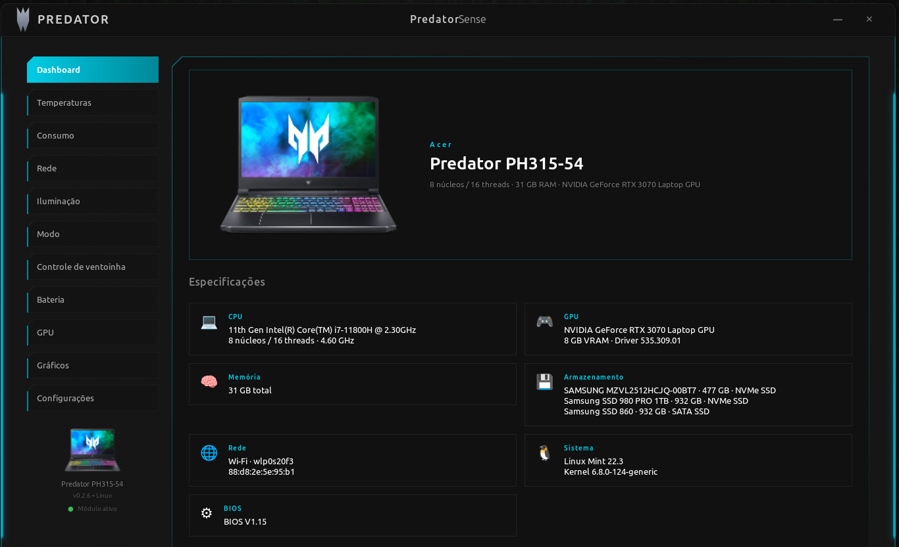</p>

<p align="center"><b>Temperatures</b> — Live gauges for CPU, GPU, system, NVMe drives, WiFi and RAM, all in one screen.</p>
<p align="center">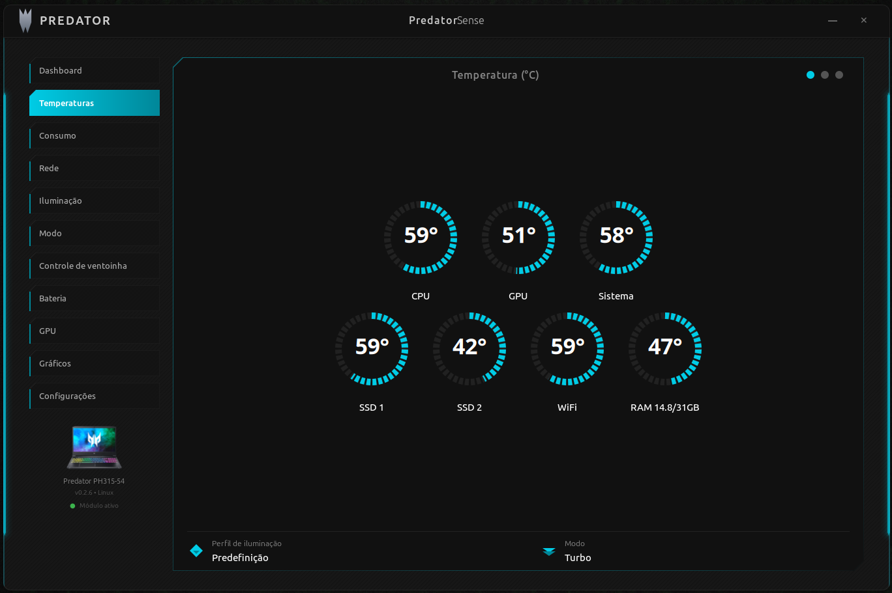</p>

<p align="center"><b>Usage</b> — CPU, GPU, memory and storage with top processes, animated bars and click-to-expand details (with a CSS-style fire animation on the temperature gauge).</p>
<p align="center">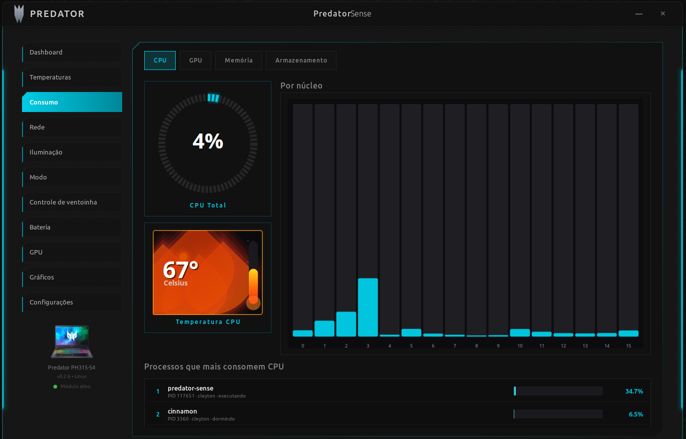</p>

<p align="center"><b>Network</b> — Real-time download/upload graphs with peak tracking and automatic interface detection (Wi-Fi or Ethernet).</p>
<p align="center">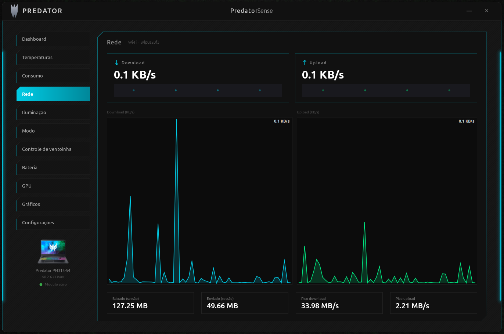</p>

<p align="center"><b>Lighting</b> — Static per-zone (4 sections) and dynamic RGB keyboard effects (Breathing, Neon, Wave, Shifting, Zoom).</p>
<p align="center">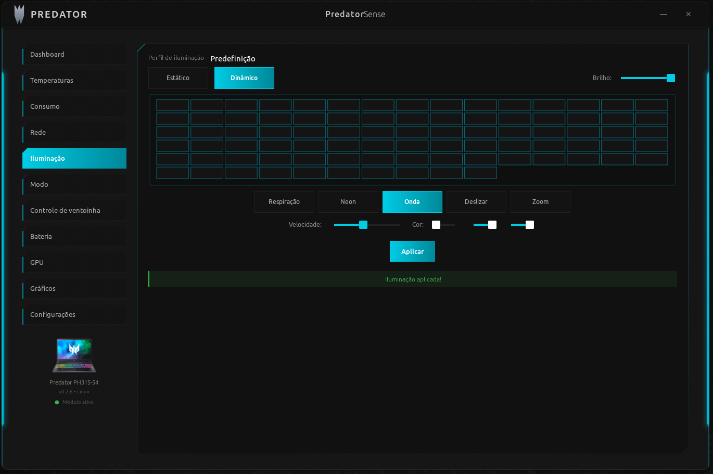</p>

<p align="center"><b>Modes</b> — Performance profiles: Quiet, Balanced, Performance and Turbo (CPU governor + Intel EPP + GPU power limit).</p>
<p align="center">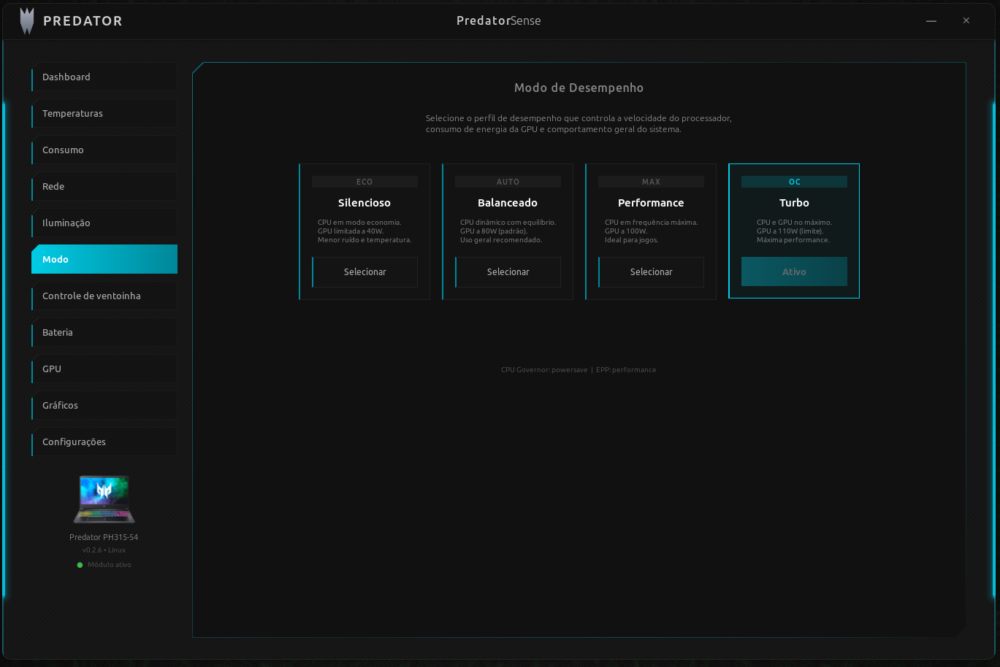</p>

<p align="center"><b>Fan Control</b> — Live RPM with animated spinning fans, CoolBoost toggle and Auto/Max modes.</p>
<p align="center">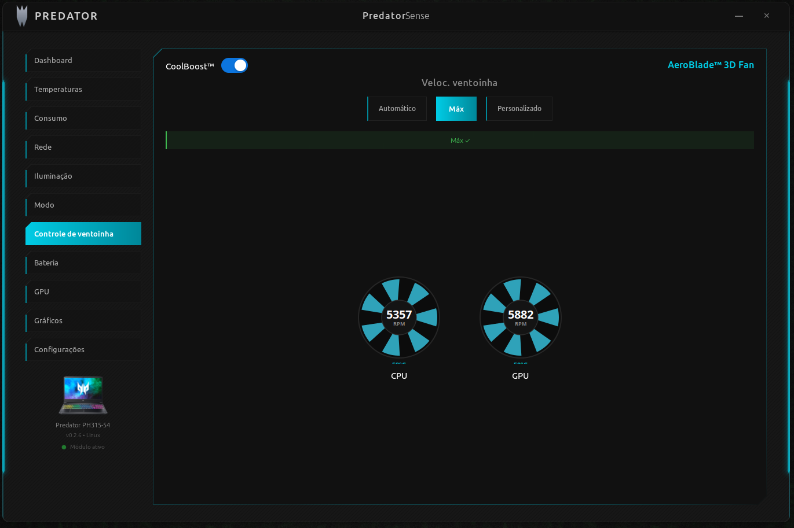</p>

<p align="center"><b>Battery</b> — Charge percentage, voltage, current, power, cycles, health, manufacturer and 80% charge limit for longevity.</p>
<p align="center">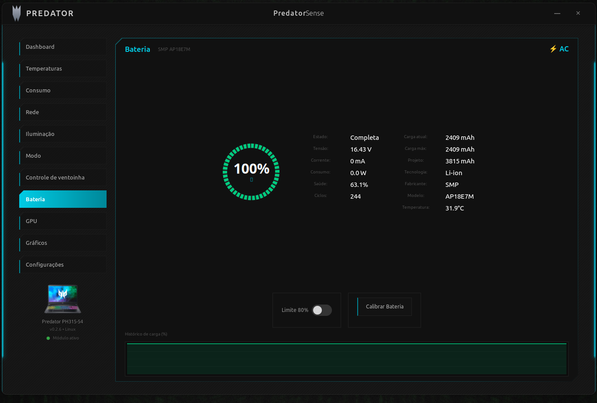</p>

<p align="center"><b>GPU</b> — NVIDIA dashboard with live graphs, clocks, utilization, VRAM, power draw and PCIe info.</p>
<p align="center">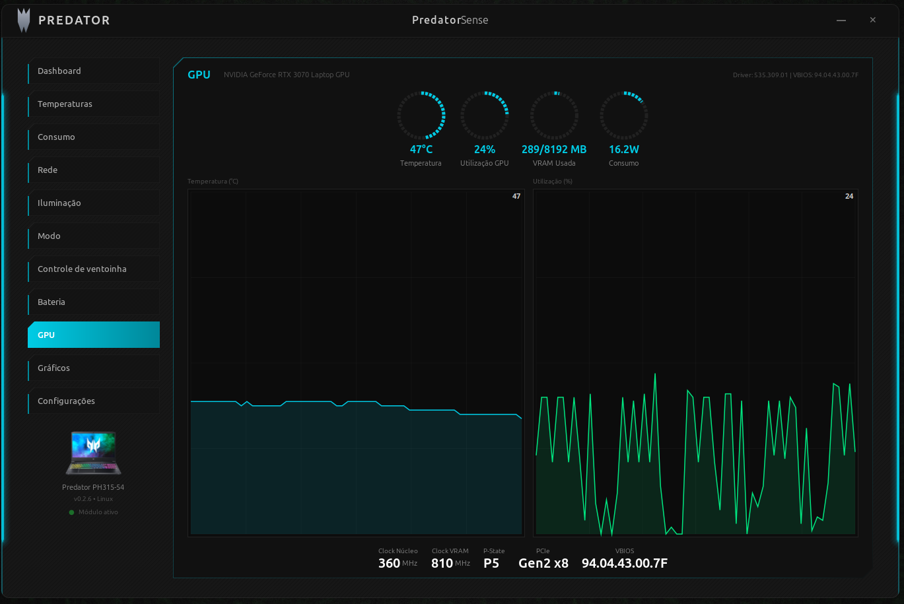</p>

<p align="center"><b>Graphs</b> — Detailed CPU and GPU history charts with min/max tracking.</p>
<p align="center">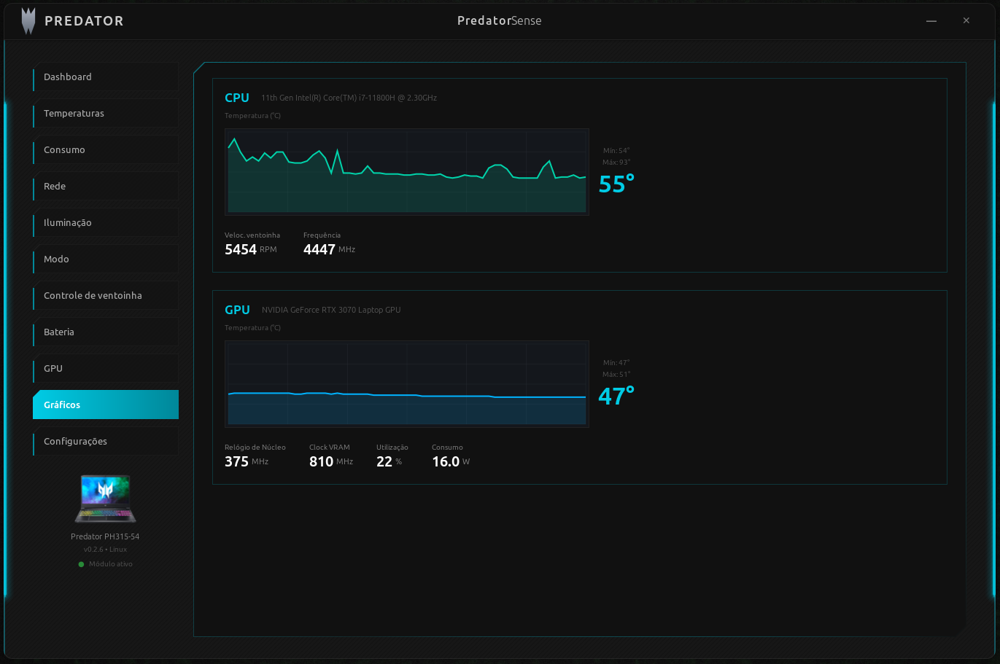</p>

<p align="center"><b>Settings</b> — Minimize to tray, start on boot, auto-apply profile on start, language preferences.</p>
<p align="center">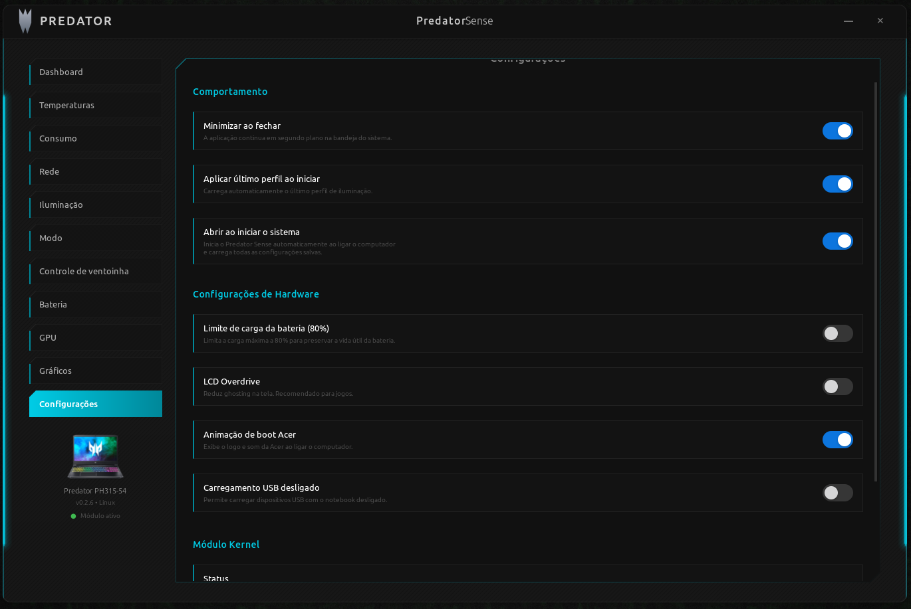</p>

---

## About

Unofficial Linux kernel module for Acer Gaming laptop RGB keyboard backlighting and Turbo mode (Acer Predator, Acer Helios, Acer Nitro).

Inspired by and based on the [acer-predator-turbo-and-rgb-keyboard-linux-module](https://github.com/JafarAkhondali/acer-predator-turbo-and-rgb-keyboard-linux-module) project by [JafarAkhondali](https://github.com/JafarAkhondali) and contributors. This project extends the existing Linux Acer-WMI kernel module to support Acer gaming functions, and adds a **full GUI desktop application** built with Rust and GTK4.

---

## Features

| Feature | Description |
|---------|-------------|
| **Dashboard** | Laptop photo + complete system specs (CPU, GPU, RAM, storage, network, OS) |
| **Temperatures** | Live gauges for CPU, GPU, system, NVMe, WiFi and RAM |
| **Usage** | 4-tab view: CPU / GPU / Memory / Storage with top processes, click-to-expand details and CSS-style fire animation on the temperature gauges |
| **Network** | Real-time download/upload graphs with peak tracking and auto interface detection |
| **RGB Keyboard Control** | Static per-zone (4 zones) and dynamic effects (Breathing, Neon, Wave, Shifting, Zoom) |
| **Performance Profiles** | Quiet / Balanced / Performance / Turbo modes (CPU governor + Intel EPP + GPU power limit) |
| **Fan Control** | Live RPM with animated spinning fans, CoolBoost toggle and Auto/Max modes |
| **Battery** | Charge stats, cycles, health, manufacturer info and 80% charge limit for longevity |
| **GPU Dashboard** | NVIDIA metrics: temperature, utilization, VRAM, clocks, power draw, PCIe info with live graphs |
| **Graphs** | Detailed CPU and GPU history charts with min/max tracking |
| **System Tray** | Minimize to tray with the Predator icon — app stays alive in background |
| **PredatorSense Key** | Hardware key mapping — the key next to NumLock opens the app |
| **DKMS** | Kernel modules rebuild automatically across kernel upgrades |
| **Internationalization** | Automatic English / Portuguese based on system locale |
| **Gaming UI** | Dark theme with pulsing cyan neon bars, dashed circular gauges, polygon panel borders |

---

## Compatibility

**Will this work on my laptop?**

Legend: ✅ tested & working · 🟡 implemented, not tested (needs a tester) · 🧪 experimental (needs a tester) · ❌ not working · `-` not applicable

| Product Name | Turbo (Impl.) | Turbo (Tested) | RGB (Impl.) | RGB (Tested) | Fan RPM read | Fan profiles | Fan PWM % |
|--------------|:---:|:---:|:---:|:---:|:---:|:---:|:---:|
| AN515-45 | - | - | ✅ | ✅ | 🟡 | - | ❌ |
| AN515-55 | - | - | ✅ | ✅ | 🟡 | - | ❌ |
| AN515-56 | - | - | ✅ | ✅ | 🟡 | - | ❌ |
| AN515-57 | - | - | ✅ | ✅ | 🟡 | - | ❌ |
| AN515-58 | - | - | ✅ | ✅ | 🟡 | 🟡 | 🧪 |
| AN517-41 | - | - | ✅ | ✅ | 🟡 | - | ❌ |
| PH315-52 | ✅ | ✅ | ✅ | ✅ | 🟡 | - | ❌ |
| PH315-53 | ✅ | ✅ | ✅ | ✅ | 🟡 | - | ❌ |
| **PH315-54** | ✅ | ✅ | ✅ | ✅ | ✅ | ✅ | ❌ |
| PH315-55 | ✅ | 🟡 | ✅ | ❌ | 🟡 | - | ❌ |
| PH317-53 | ✅ | ✅ | ✅ | ✅ | 🟡 | - | ❌ |
| PH317-54 | ✅ | 🟡 | ✅ | 🟡 | 🟡 | - | ❌ |
| PH317-55 | ✅ | 🟡 | ✅ | 🟡 | 🟡 | - | ❌ |
| PH517-51 | ✅ | 🟡 | ✅ | 🟡 | 🟡 | - | ❌ |
| PH517-52 | ✅ | 🟡 | ✅ | 🟡 | 🟡 | - | ❌ |
| PH517-61 | 🟡 | 🟡 | ✅ | ✅ | 🟡 | - | ❌ |
| PHN16-71 | ✅ | 🟡 | ✅ | 🟡 | 🟡 | 🟡 | ❌ |
| PHN16-72 | ✅ | 🟡 | ✅ | 🟡 | 🟡 | 🟡 | 🧪 |
| **PHN16-73** | ✅ | 🟡 | ✅ | 🟡 | 🟡 | 🟡 | 🧪 |
| PHN18-71 | ✅ | ✅ | ✅ | ✅ | 🟡 | 🟡 | ❌ |
| PT314-51 | ❌ | ❌ | ✅ | ✅ | 🟡 | - | ❌ |
| PT314-52s | ✅ | ✅ | ✅ | 🟡 | 🟡 | - | ❌ |
| PT315-51 | ✅ | ✅ | ✅ | ✅ | 🟡 | - | ❌ |
| PT316-51 | ✅ | ✅ | ✅ | ✅ | 🟡 | - | ❌ |
| PT515-51 | ✅ | ✅ | ✅ | ✅ | 🟡 | - | ❌ |
| PT516-52s | ✅ | 🟡 | ✅ | ✅ | 🟡 | - | ❌ |
| PT917-71 | ✅ | 🟡 | ✅ | 🟡 | 🟡 | - | ❌ |

> If your model is not listed, it may still work — the kernel module detects compatible WMI interfaces automatically. If it worked (or didn't) for you, please open an issue mentioning your model so we can update this table.

### Fan control — three levels

| Level | What it does | Availability |
|---|---|---|
| **Fan RPM read** | Read CPU/GPU fan speed (`fan1_input`, `fan2_input`) | Most gaming models (auto-detected) |
| **Fan profiles** | Quiet / Balanced / Performance / Turbo via `platform_profile` | `predator_v4` models |
| **Fan PWM %** 🧪 | Per-fan speed control (`pwm1`/`pwm2` 0–100%) ported from mainline `acer-wmi` via WMI — **kernel ≥ 6.14 only** | Subset of models with `ACER_CAP_PWM` (AN515-58, PHN16-72/73, …) |

> **🧪 PWM fan control is experimental.** It is ported from the upstream Linux kernel `acer-wmi` driver and uses safe WMI methods (no raw EC writes), but it has **not been verified on real hardware** by the maintainer (who owns a PH315-54, which has no PWM). If you have a supported model, testing reports are very welcome. **Use at your own risk** — see the disclaimer at the top.

---

## Installation

### One-Line Install (Fastest)

Open a terminal and run:

```bash
sudo rm -f /tmp/ps-install.sh && curl -fsSL https://raw.githubusercontent.com/cleyton1986/predator-sense/main/scripts/remote-install.sh -o /tmp/ps-install.sh && sudo bash /tmp/ps-install.sh
```

That's it! Everything is downloaded, compiled, and configured automatically.

### Interactive Installer (Offline)

Download the `predator-sense-installer` binary from the [Releases](../../releases) page:

```bash
chmod +x predator-sense-installer
sudo ./predator-sense-installer
```

Select **option 1** (Full Installation). The installer will automatically:

1. Detect your distribution (Debian/Ubuntu/Mint, Fedora, Arch)
2. Install system dependencies (GTK4, libadwaita, build tools, kernel headers)
3. Install Rust (if not present)
4. Compile the application
5. Compile and load the `facer` kernel module
6. Create desktop menu entry with icon
7. Map the PredatorSense hardware key (auto-start on login)
8. Set up system tray support

After installation, open the app by:
- Pressing the **PredatorSense key** (next to NumLock)
- Searching **"Predator Sense"** in your application menu
- Running `/opt/predator-sense/predator-sense` in a terminal

### Manual Install (Build from source)

#### Prerequisites

<details>
<summary><b>Debian / Ubuntu / Linux Mint</b></summary>

```bash
sudo apt install libgtk-4-dev libadwaita-1-dev pkg-config build-essential \
    gcc make linux-headers-$(uname -r) libayatana-appindicator3-dev
```
</details>

<details>
<summary><b>Fedora</b></summary>

```bash
sudo dnf install gtk4-devel libadwaita-devel pkg-config gcc make \
    kernel-devel-$(uname -r)
```
</details>

<details>
<summary><b>Arch Linux</b></summary>

```bash
sudo pacman -S gtk4 libadwaita pkgconf gcc make linux-headers
```
</details>

**Rust** (if not installed):
```bash
curl --proto '=https' --tlsv1.2 -sSf https://sh.rustup.rs | sh
source ~/.cargo/env
```

#### Build & Install

```bash
# Clone the repository
git clone https://github.com/cleyton1986/predator-sense.git
cd predator-sense/predator-sense-gui

# Build the application
cargo build --release

# Compile the kernel module
cd kernel && make && cd ..

# Load the kernel module
sudo rmmod acer_wmi 2>/dev/null
sudo modprobe wmi sparse-keymap video
sudo insmod kernel/facer.ko

# Install
sudo mkdir -p /opt/predator-sense/resources
sudo cp target/release/predator-sense /opt/predator-sense/
sudo cp resources/* /opt/predator-sense/resources/
sudo chmod +x /opt/predator-sense/predator-sense

# Run
/opt/predator-sense/predator-sense
```

---

## Usage

### Keyboard RGB

1. Go to **Lighting** in the sidebar
2. Choose **Static** (per-zone colors) or **Dynamic** (effects)
3. **Static mode:** adjust R/G/B sliders for each of the 4 keyboard sections
4. **Dynamic mode:** select an effect (Breathing, Neon, Wave, Shifting, Zoom) and adjust speed
5. Click **Apply**

### Performance Profiles

| Profile | CPU Governor | Intel EPP | GPU Power | Use Case |
|---------|-------------|-----------|-----------|----------|
| **Quiet** | powersave | power | 40W | Silent work |
| **Balanced** | powersave | balance_performance | 80W | General use |
| **Performance** | performance | performance | 100W | Gaming |
| **Turbo** | performance | performance | 110W | Maximum performance |

### GPU Dashboard

Real-time NVIDIA GPU monitoring:
- Temperature, utilization, VRAM usage, power draw (circular gauges)
- Live temperature and utilization history graphs (2 min window)
- Core clock, memory clock, P-State, PCIe link info, VBIOS version

---

## Installer Options

The Go installer provides an interactive TUI:

```bash
sudo ./predator-sense-installer              # Interactive menu
sudo ./predator-sense-installer --install    # Direct full install
sudo ./predator-sense-installer --uninstall  # Remove everything
sudo ./predator-sense-installer --status     # Show component status
```

---

## Uninstall

```bash
sudo ./predator-sense-installer  # Select option 2
```

Or manually:
```bash
pkill -f "/opt/predator-sense/predator-sense"
sudo rm -rf /opt/predator-sense
sudo rm -f /usr/share/applications/predator-sense.desktop
sudo rm -f /usr/share/icons/hicolor/128x128/apps/predator-sense.png
rm -f ~/.config/systemd/user/predator-sense-hotkey.service
rm -f ~/.config/autostart/predator-sense-hotkey.desktop
sudo rmmod facer  # Optional: unload kernel module
```

---

## Troubleshooting

<details>
<summary><b>Keyboard RGB not changing / stuck on one effect</b></summary>

The kernel module state may be stuck. Reload it:
```bash
sudo rmmod facer
sudo insmod /path/to/kernel/facer.ko
# Or use the installer: sudo ./predator-sense-installer → Option 4
```
</details>

<details>
<summary><b>Module not loading</b></summary>

```bash
# Check WMI device exists
ls /sys/bus/wmi/devices/7A4DDFE7-5B5D-40B4-8595-4408E0CC7F56/

# Check kernel logs
sudo dmesg | grep -i facer

# Ensure headers match your kernel
sudo apt install linux-headers-$(uname -r)
```
</details>

<details>
<summary><b>PredatorSense key not working</b></summary>

```bash
# Check daemon is running
pgrep -f hotkey-daemon.py

# Ensure user is in 'input' group (logout required after adding)
groups | grep input
sudo usermod -aG input $USER
```
</details>

<details>
<summary><b>NVIDIA GPU page shows no data</b></summary>

```bash
# Verify nvidia-smi works
nvidia-smi
# If not, install NVIDIA proprietary drivers
```
</details>

---

## Project Structure

```
predator-sense-gui/
├── kernel/                      # Linux kernel modules (DKMS-managed)
│   ├── facer.c                  # ACPI/WMI interface to Acer hardware
│   ├── acer-wmi-battery.c       # Battery charge limit support
│   ├── acpi_ec.c                # Raw EC access via /dev/ec (from MusiKid/acpi_ec)
│   ├── Makefile
│   └── dkms.conf                # DKMS auto-rebuild config
├── installer/                   # Go interactive installer (static binary)
│   ├── main.go                  # Installer + DKMS registration
│   └── i18n.go
├── src/                         # Rust GTK4 application
│   ├── main.rs
│   ├── app_state.rs             # Global window-visibility flag (gates timers)
│   ├── i18n.rs                  # EN/PT internationalization
│   ├── config.rs                # User preferences (JSON)
│   ├── tray.rs                  # System tray (AyatanaAppIndicator)
│   ├── hardware/
│   │   ├── rgb.rs               # RGB via /dev/acer-gkbbl-*
│   │   ├── hwmon.rs             # /sys/class/hwmon index (cached OnceLock)
│   │   ├── sensors.rs           # Temps, fans, RAM, network
│   │   ├── gpu.rs               # nvidia-smi parser with TTL cache
│   │   ├── procs.rs             # /proc sampler (CPU per-core, memory, process list)
│   │   ├── storage.rs           # Disk usage via df
│   │   ├── sysinfo.rs           # DMI + CPU + GPU + OS specs
│   │   ├── fan.rs               # Fan mode + CoolBoost
│   │   ├── extras.rs            # Battery limit, LCD overdrive, USB charging, boot anim
│   │   ├── profile.rs           # CPU governor + EPP + GPU power
│   │   └── setup.rs             # Kernel module management
│   └── ui/                      # GTK4 pages (Cairo custom widgets)
│       ├── window.rs            # Main window, sidebar, neon bars, hide-to-tray
│       ├── dashboard_page.rs    # Hero + system specs
│       ├── temperatures_page.rs # All temperature gauges
│       ├── usage_page.rs        # CPU/GPU/Mem/Storage with top processes
│       ├── network_page.rs      # Download/upload with peak tracking
│       ├── rgb_page.rs          # Keyboard RGB with visual zones
│       ├── fan_control_page.rs  # Animated fans + CoolBoost
│       ├── fan_page.rs          # Performance profiles
│       ├── battery_page.rs      # Battery stats + charge limit
│       ├── gpu_page.rs          # NVIDIA GPU dashboard
│       ├── monitor_page.rs      # Detailed CPU/GPU history graphs
│       ├── setup_page.rs        # Kernel module setup wizard
│       └── gauge_widget.rs      # Dashed circular gauge widget
└── resources/
    ├── style.css                # Gaming dark theme
    ├── predator-icon.svg        # System tray icon
    └── tray_helper.py           # Tray helper (Python/GTK3)
```

---

## Credits & Acknowledgments

- **Kernel module `facer`** based on the [acer-predator-turbo-and-rgb-keyboard-linux-module](https://github.com/JafarAkhondali/acer-predator-turbo-and-rgb-keyboard-linux-module) project by [JafarAkhondali](https://github.com/JafarAkhondali) and [all contributors](https://github.com/JafarAkhondali/acer-predator-turbo-and-rgb-keyboard-linux-module/graphs/contributors)
- **Kernel module `acpi_ec`** by [Sayafdine Said (MusiKid)](https://github.com/MusiKid/acpi_ec) — exposes `/dev/ec` for raw EC read/write. Used by the helper to set fan modes, CoolBoost, LCD overdrive, USB charging and boot animation.
- **GUI Application** built with [Rust](https://www.rust-lang.org/) + [GTK4](https://gtk.org/) + [libadwaita](https://gnome.pages.gitlab.gnome.org/libadwaita/)
- **Installer** built with [Go](https://go.dev/)

## Support the Project

If this project was useful to you and you'd like to support its development, consider buying me a coffee:

<p align="center">
  <a href="https://www.paypal.com/cgi-bin/webscr?cmd=_donations&business=cleyton1986%40gmail.com&currency_code=BRL&item_name=Predator+Sense+for+Linux">
    
  </a>
</p>

<p align="center">
  <b>PIX (Brazil):</b> <code>cleyton1986@gmail.com</code>
</p>

Any contribution is voluntary and greatly appreciated! It helps keep the project alive and motivates new features.

---

## License

This project is licensed under the **GNU General Public License v3.0** — see the [LICENSE](LICENSE) file for details.

This is free software: you can redistribute it and/or modify it under the terms of the GNU GPL as published by the Free Software Foundation.

**This software is provided "as is", without warranty of any kind.** The authors are not responsible for any damage that may occur from using this software. By installing and using this software, you acknowledge that you do so at your own risk.
